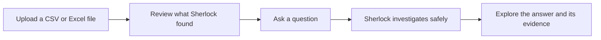
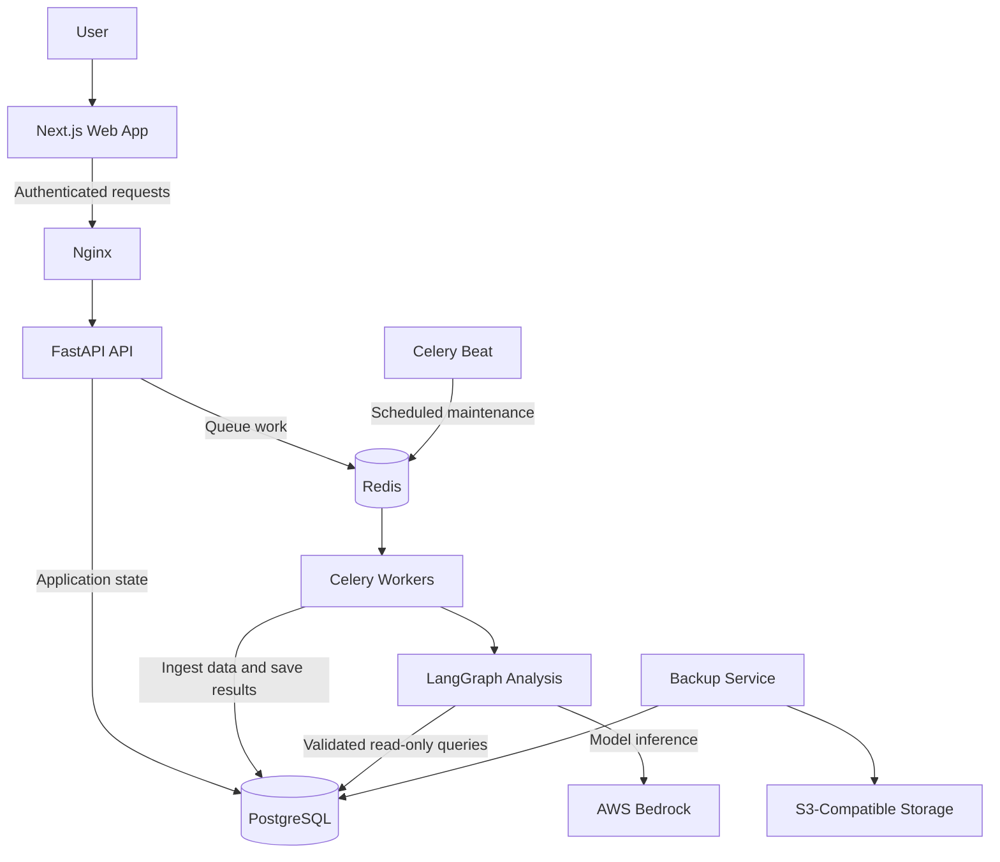

<div align="center">

# Sherlock

### Ask your spreadsheet a question. Get an answer you can actually trust.

Sherlock turns CSV and Excel files into clear, evidence-backed answers. Upload a dataset, ask questions in plain English, and explore the results through charts, tables, KPIs, and useful data-quality notes.


</div>

---

## What Is Sherlock?

Most spreadsheets have a story hidden inside them. The difficult part is getting to it.

Finding a simple answer can quickly turn into formulas, pivot tables, SQL queries, or a long wait for someone else to investigate the data. Sherlock makes that process feel more like a conversation.

You can ask:

> Which region brought in the most revenue?

> What changed compared with last month?

> Which products are hurting our margins?

> Can I trust this result, or is the data incomplete?

Sherlock looks at the data, runs the analysis safely, and shows the evidence behind its answer. It is not just a chat window placed on top of a spreadsheet. It is a complete investigation workflow built around reliable data.

## How It Works



### 1. Bring Your Data

Upload a CSV or Excel workbook. Sherlock inspects the file first, and if the workbook has several sheets, you can choose the one you want to explore.

### 2. Get To Know It

Before asking questions, you can preview the rows, review the detected columns, and see any quality concerns Sherlock found.

### 3. Ask Naturally

Ask the same question you would ask an analyst. There is no need to write SQL, build a dashboard, or prepare formulas.

### 4. Follow The Evidence

Sherlock answers with a clear explanation and supports it with the most useful format for the result: a table, chart, KPI, or data-quality note.

### 5. Keep Investigating

Your investigations are saved, so you can return later, reopen a conversation, and continue where you left off.

## What Sherlock Handles For You

| Capability | What you get |
| --- | --- |
| **CSV and Excel support** | A guided upload flow for CSV files and Excel worksheets |
| **Natural-language analysis** | Useful answers without writing queries or formulas |
| **Evidence with every answer** | Findings supported by exact values, tables, charts, and KPIs |
| **Data-quality awareness** | Warnings about missing values, duplicates, unusual patterns, and PII-like data |
| **Safe analysis** | Strictly validated queries running through read-only database access |
| **Durable investigations** | Conversations and results that survive refreshes and can be reopened |
| **Responsive workspace** | A focused investigation experience on desktop and mobile |

## Built Around Trust

The language model is good at understanding what someone means. It should not be the final authority on the answer.

Sherlock keeps those responsibilities separate:

```text
The LLM suggests.
The backend validates.
PostgreSQL executes.
The UI presents evidence.
```

When you ask a question, the model proposes a small analysis plan. Sherlock checks that plan, allows it to read only the active dataset, runs it through a read-only database connection, and then asks the model to explain the returned evidence.

This approach keeps the experience conversational without giving up the checks that make data analysis dependable.

## Thoughtful Data Handling

Real-world spreadsheets are rarely clean. Sherlock takes care of the common problems without hiding what changed:

- Missing values remain missing instead of being silently replaced.
- Exact duplicate rows are removed during ingestion.
- Column names are cleaned and profiled.
- Potential personal information is flagged for review.
- Each conversation stays tied to one dataset.
- Raw uploaded files are removed after the data is safely ingested.
- Internal SQL, prompts, and debug details stay out of the user experience.

## The Technology Behind Sherlock

You do not need to understand the stack to use Sherlock, but each part has a clear job.

| Layer | Technology | What it does |
| --- | --- | --- |
| Web experience | Next.js, React, TypeScript | Provides the upload, review, and investigation workspace |
| Authentication | Clerk | Handles secure sign-in and protected sessions |
| Application API | FastAPI, Pydantic, SQLAlchemy | Manages users, datasets, chats, messages, and durable state |
| Analysis workflow | LangGraph, AWS Bedrock | Plans investigations and explains verified results |
| Background work | Celery, Redis | Runs ingestion, analysis, retries, and maintenance away from web requests |
| Data | PostgreSQL, pgvector | Stores application records, dataset tables, and workflow checkpoints |
| Operations | Docker Compose, Nginx, S3-compatible storage | Runs services, routes traffic, checks health, and keeps backups |

The detailed product and architecture decisions live in [system_design.md](system_design.md). The current build record lives in [IMPLEMENTATION_PROGRESS.md](IMPLEMENTATION_PROGRESS.md).

## A Closer Look At The Architecture

Sherlock is split into a web application, an API, background workers, an analysis workflow, and a database. The API stays responsive by recording work first and handing longer jobs to Celery workers. PostgreSQL remains the source of truth from the moment a file is uploaded to the moment an answer appears.



### Web Application

The Next.js frontend is where an investigation comes together. It handles sign-in, file upload, dataset review, conversations, status updates, responsive panels, and the visual blocks used to present an answer.

### API And Durable State

FastAPI owns the application rules. It checks authentication, keeps users separated, validates requests, records uploads and conversations, and creates durable work before anything is sent to a background worker.

### Background Workers

Celery workers handle the work that should not be tied to a browser request. They ingest files, run analysis, retry temporary failures, clean up expired uploads, and recover work that was interrupted.

### PostgreSQL

PostgreSQL stores the application records, uploaded datasets, investigation history, and LangGraph checkpoints. Each dataset is placed in its own physical table inside the `user_data` schema. Generated analysis uses a dedicated read-only database role.

### LangGraph And Bedrock

LangGraph gives the analysis a clear beginning and end. It loads context, creates a small plan, runs validated queries, builds the response, and saves the result. AWS Bedrock helps understand the question and explain the evidence, but it never gets unrestricted database access.

## From Upload To Dataset

```text
Upload a file
  -> inspect its type, size, sheets, and columns
  -> let the user review and name the dataset
  -> create a durable ingestion job
  -> clean, profile, and store the data
  -> save quality information
  -> make the dataset ready for investigation
  -> remove the raw upload
```

Sherlock accepts CSV and XLSX files up to 25 MB and 100 detected columns. Macro-enabled workbooks are rejected, and one worksheet becomes one focused dataset.

## From Question To Answer

```text
Ask a question
  -> save the message and analysis run
  -> load the dataset, schema, quality notes, and conversation context
  -> create a small analysis plan
  -> validate and run read-only queries
  -> explain only the returned evidence
  -> save and display the answer
```

Generated queries are limited to the current dataset. Dangerous statements, schemas, functions, comments, and multiple statements are blocked. SQL repair is limited, and an answer is saved before an analysis run is considered complete.

## Reliability By Design

Sherlock treats uploads and analysis as durable work rather than temporary browser actions.

- Work is recorded before it is queued.
- Repeated requests do not create duplicate messages or results.
- Workers can restart without losing completed work.
- Failed analysis becomes a useful, recoverable state.
- Scheduled maintenance cleans old uploads and recovers stuck runs.
- LangGraph checkpoints are stored in PostgreSQL.
- Production services start in dependency order and report their health.
- PostgreSQL backups are stored locally and copied off-site.

## Repository Structure

```text
.
├── apps/
│   ├── api/
│   │   ├── alembic/             Database migrations
│   │   └── app/
│   │       ├── agents/          LangGraph workflow and checkpointing
│   │       ├── api/routes/      Versioned HTTP endpoints
│   │       ├── core/            Configuration, database, errors, and logging
│   │       ├── db/              Models and repositories
│   │       ├── services/        Product and analysis logic
│   │       └── workers/         Celery configuration and tasks
│   └── web/
│       └── src/                 Next.js application and components
├── infra/
│   ├── nginx/                   Reverse-proxy configuration
│   └── postgres/                Read-only role and backup automation
├── docker-compose.dev.yml       Local services
├── docker-compose.prod.yml      Production service topology
├── system_design.md             Full product and architecture specification
└── IMPLEMENTATION_PROGRESS.md   Build progress record
```

## Run Sherlock Locally

<details>
<summary><strong>Prerequisites and setup</strong></summary>

### Prerequisites

- Python 3.12+
- [uv](https://docs.astral.sh/uv/)
- Node.js 24+
- pnpm 10+
- Docker and Docker Compose

### Start PostgreSQL And Redis

```bash
docker compose -f docker-compose.dev.yml up -d
```

### Start The API

```bash
cd apps/api
cp .env.example .env
uv sync
uv run alembic upgrade head
uv run python -m app.scripts.setup_checkpointer
uv run uvicorn app.main:app --reload
```

### Start The Worker

```bash
cd apps/api
uv run celery -A app.workers.celery_app.celery_app worker --loglevel=INFO
```

### Start Scheduled Maintenance

```bash
cd apps/api
uv run celery -A app.workers.celery_app.celery_app beat --loglevel=INFO
```

### Start The Web Application

```bash
cd apps/web
cp .env.example .env.local
pnpm install
pnpm dev
```

Open `http://127.0.0.1:3000`.

</details>

<details>
<summary><strong>Configuration</strong></summary>

The repository includes safe templates for each environment:

- `apps/api/.env.example` for backend development.
- `apps/api/.env.docker` for the production backend.
- `apps/web/.env.example` for the frontend.
- `infra/postgres/backup.env.docker` for backup settings.

Configure Clerk for authentication, AWS Bedrock for model inference, PostgreSQL for application and read-only access, Redis for Celery, and S3-compatible storage for off-site backups.

Real credentials belong in local or deployment secrets, never in source control. Production startup checks the configuration before migrations or application services begin.

</details>

<details>
<summary><strong>Production deployment</strong></summary>

Sherlock's production setup places the Next.js frontend on Vercel and runs Nginx, FastAPI, Celery workers, Celery beat, Redis, PostgreSQL, migrations, and backups on a Docker host.

1. Configure the Vercel project using `apps/web/.env.example`.
2. Replace the placeholders in `apps/api/.env.docker` and `infra/postgres/backup.env.docker`.
3. Configure the public HTTPS origin, Clerk, Bedrock, PostgreSQL, Redis, and off-site backups.
4. Start the backend:

   ```bash
   docker compose -f docker-compose.prod.yml up -d --build
   ```

5. Confirm the one-time preflight, read-only role provisioning, and migrations complete successfully.
6. Confirm the long-running API, worker, scheduler, backup, Redis, PostgreSQL, and Nginx services are healthy.

</details>

## Focused By Design

Sherlock is built around one clear idea: make a single spreadsheet investigation genuinely useful before making it complicated.

Each investigation works with one CSV file or Excel worksheet. That keeps the evidence boundary clear, makes answers easier to trust, and gives the user a calm place to explore their data.
